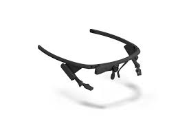
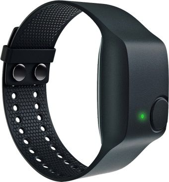
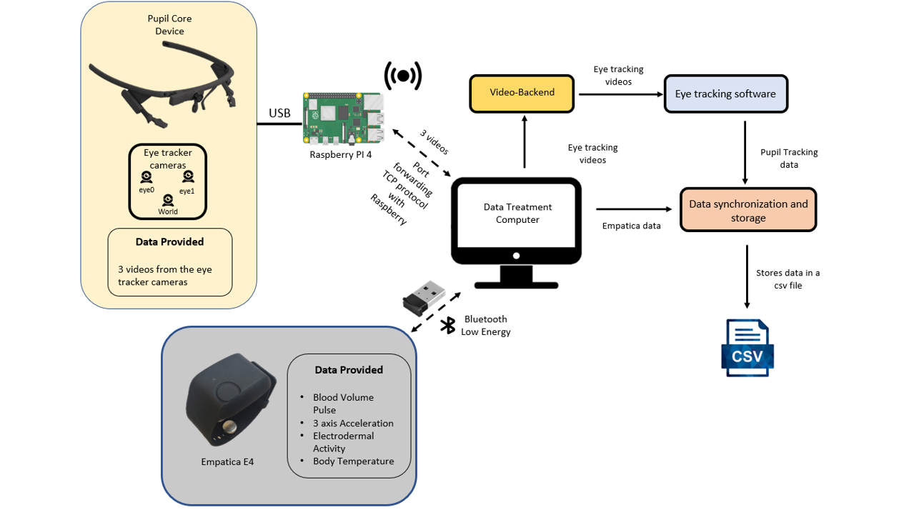

# Remote Pupil Core Device & Empatica E4

Hi ! :wave:

Sorry for the mess in this project's code and readMe! I am currently cleaning the project's code and building :construction_worker: the readMe! It will be updated soon... :hourglass: 
Yet I tried to quickly summarize the process and workflow and I added a small <a href='./ReadME.txt'>tutorial</a>. :smiley:

## Table Of Contents
* [Introduction](#introduction)
* [How does it work?](#how-does-it-work)
* [How to install and make it work?](#how-to-install-and-make-it-work)

## Introduction

This project aims to create a data collection system using the <a href="https://pupil-labs.com/products/core/" target="_blank">Pupil Core Device</a> and the <a href="https://www.empatica.com/en-eu/research/e4/" target="_blank">Empatica E4</a>. This system can collect, process, synchronize data (of the 2 devices), and store data in real-time with a wireless process. That means that Pupil Core device will not be wired to the computer and Empatica E4 data will be collected in real-time using a Bluetooth Low Energy Protocol.

## How does it work?

### Pupil Core Device Wireless

The first part of the system is the <a href="https://pupil-labs.com/products/core/" target="_blank">Pupil Core Device</a> which needs a USB connection to a computer to work properly. Usually, the Pupil Core Device feeds the wired computer with 3 video streams (eye 0: left eye, eye 1: right eye, world: word camera), then the computer uses the <a href="https://docs.pupil-labs.com/core/software/pupil-capture/" target="_blank">Pupil Capture Software</a> to compute the pupil tracking.
Our goal is to make the Pupil Core device wireless, in this regard I chose to wire the Pupil Core Device to a Raspberry Pi 4 that was alimented by a portable battery. The issue is that pupil tracking software is using GPU power to compute the tracking and the data, it was impossible to use the Raspberry to process the videos of the Pupil Core Device directly on the Raspberry. Yet it is possible to redirect the 3 video streams to a computer with GPU using port forwarding with TCP protocol between the Raspberry and the computer. Once the stream is redirected, the <a href="https://github.com/Lifestohack/pupil-video-backend" target="_blank">pupil backend</a> (that I found on GitHub) provides a solution to redirect the stream to the Pupil Capture software that will compute the pupil tracking from the 3 redirected video streams. The Pupil Capture software data can be read in real-time using the <a href="https://docs.pupil-labs.com/developer/core/network-api/" target="_blank">network API</a>.

  

### Empatica E4 Wireless

The Empatica E4 is a data-collection wristband that records Blood Volume Pulse, 3-axis Acceleration, Electrodermal Activity, and Body Temperature. Empatica provides a solution to access the data of the wristband in real-time: <a href="https://developer.empatica.com/windows-streaming-server.html" target="_blank">the Empatica Streaming Server</a>. The wristband and the computer are connected using a BLE Dongle (thus a Bluetooth Low Energy protocol), the communication with the wristband can be done using the Empatica streaming server software, and it is then possible to collect the data of the device in real-time by subscribing to the data channel.

  

### Synchronization
Both data of Empatica and Pupil Capture data(eye tracking data from Pupil Core Device) are collected by the <a href="./Record_Client.py" target="_blank">Python script Record_Client.py</a> (which will be more clear in a future update). The data are syncrhonized using the timestamp of both data, to synchronize the data an offset between the data is computed. Once the data synchronization completed, the data are stored in a csv file.

### Illustration of the system

  

## How to install and make it work ?

For now, I need to clean up the code and write a better tutorial, yet you can still have a look at <a href="./ReadMe.txt" target="_blank">ReadMe.txt</a>.
A clear tutorial will come in the next update!